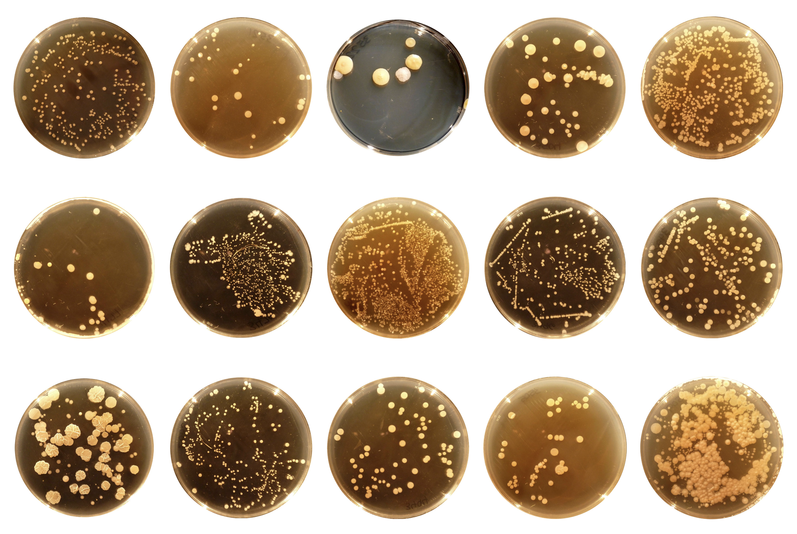

# plotly-challenge
Uses Plotly and D3.js to build an interactive dashboard to explore the Belly Button Biodiversity dataset, which catalogs the microbes that colonize human navels.

## Dataset
The dataset reveals that a small handful of microbial species (also called operational taxonomic units, or OTUs, in the study) were present in more than 70% of people, while the rest were relatively rare.
* [Belly Button Biodiversity Data](data/samples.json), with Hulcr and colleagues'(2012)  [original research publication showcase](http://robdunnlab.com/projects/belly-button-biodiversity/) and the [results and data](http://robdunnlab.com/projects/belly-button-biodiversity/results-and-data/).

- - -

## Part 1: Plotly
1. Use the D3 library to read in samples.json .
2. Create a horizontal bar chart with a dropdown menu to display the top 10 OTUs found in that individual.
- Use sample_values as the values for the bar chart.
- Use otu_ids as the labels for the bar chart. 
- Use otu_labels as the hovertext for the chart.
3. Create a bubble chart that displays each sample. 
- Use otu_ids for the x values.
- Use sample_values for the y values.
- Use sample_values for the marker size.
- Use otu_ids for the marker colors. Use otu_labels for the text values.
4. Display the sample metadata, i.e., an individual's demographic information.
5. Display each key-value pair from the metadata JSON object somewhere on the page.
6. Update all of the plots any time that a new sample is selected.
7. Additionally, create a creative layout for the dashboard. 
* The dashboard's preview:  

## Part 2: Advanced Challenge Assignment (Optional)
* Adapt the Gauge Chart from https://plot.ly/javascript/gauge-charts/ to plot the weekly washing frequency of the individual.
* You will need to modify the example gauge code to account for values ranging from 0 through 9. 
* Update the chart whenever a new sample is selected.
